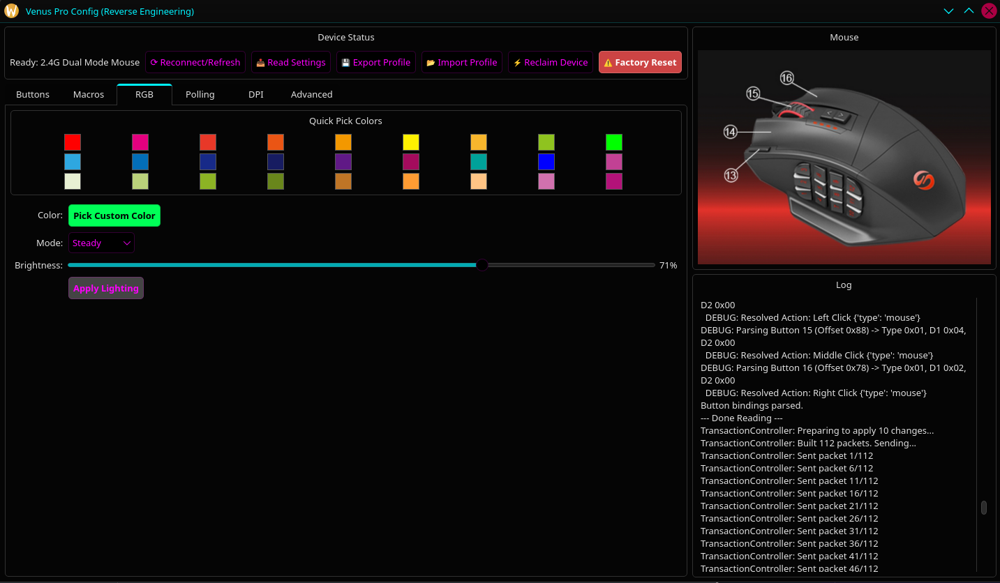
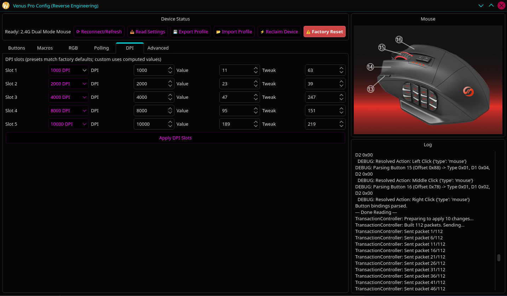

# Venus Pro Config (Linux)

A professional configuration utility for the UtechSmart Venus Pro MMO gaming mouse on Linux.

## Overview

The UtechSmart Venus Pro is a high-performance MMO gaming mouse featuring 16,000 DPI, 12 side buttons, and extensive macro capabilities. While it is an excellent tool for games like *World of Warcraft* and other MMOs, it lacks official configuration support on Linux. 

This project provides a reverse-engineered implementation of the mouse's HID protocol and a user-friendly GUI to manage bindings, macros, and lighting. It was created to fill the gap where no other viable Linux configuration methods existed.

## Features

- **Button Remapping:** Configure all 16 buttons, including the 12-button side panel.
- **Modifier Support:** Bind buttons to combinations (e.g., `Ctrl+Shift+1`, `Alt+F1`).
- **Macro Engine:** Visual macro editor to record and edit events with precise timing.
- **RGB Lighting:** Full control over LED color, brightness, and effects (Steady, Breathing, Neon, Off).
- **DPI Profiles:** Configure up to 5 DPI presets with customizable levels.
- **Polling Rate:** Adjust USB polling rate (125Hz, 250Hz, 500Hz, 1000Hz).
- **Factory Reset:** One-click recovery to restore the device to its original factory state.

## Screenshots

### Buttons Tab
Configure button bindings for all 16 mouse buttons. Supports keyboard keys, mouse actions, macros, media keys, DPI control, and special functions like Fire Key and Triple Click. Changes are staged and can be applied in batches.


### Macros Tab
Visual macro editor with recording functionality. Create complex key sequences with precise timing, add manual events, reorder steps, and preview the output. Macros can be uploaded to the mouse's internal memory and bound to any button.


### RGB Tab
Control the RGB LED lighting. Choose from 27 quick-pick colors or select a custom color. Four lighting modes are available:
- **Off** - Disable the LED
- **Steady** - Solid color at adjustable brightness
- **Neon** - Color cycling effect
- **Breathing** - Pulsing fade effect



### DPI Tab
Configure up to 5 DPI presets (100-16,000 DPI range). Each slot can be set independently. The mouse cycles through enabled presets using the DPI button.



### Polling Tab
Adjust the USB polling rate to control how frequently the mouse reports its position:
- **125Hz** (8ms response) - Lowest CPU usage
- **250Hz** (4ms response)
- **500Hz** (2ms response)
- **1000Hz** (1ms response) - Best for gaming

### Advanced Tab
Contains diagnostic and recovery tools:
- **Factory Reset** - Restores all settings to factory defaults (warning: erases all custom macros)
- **Debug Logging** - View raw HID communication for troubleshooting

## Requirements

The utility is written in Python and uses PyQt6 for the interface.

- **Python 3.8+**
- **Cython** (for hidapi)
- **hidapi**
- **PyQt6**

### Optional Dependencies
- **python-evdev** - For software macro playback
- **python-pyusb** - For advanced device management

## Installation

### Arch Linux (AUR)
```bash
yay -S venusprolinux
```

### Manual Installation

1. **Clone the repository:**
   ```bash
   git clone https://github.com/Es00bac/UtechSmart-Venus-Pro-Linux-MMO-Mouse-Utility.git
   cd UtechSmart-Venus-Pro-Linux-MMO-Mouse-Utility
   ```

2. **Install dependencies:**
   ```bash
   pip install cython hidapi PyQt6
   ```

3. **Run the installer:**
   ```bash
   ./install.sh
   ```

4. **udev Rules (Recommended):**
   To access the mouse as a non-root user, create a udev rule:
   ```bash
   echo 'SUBSYSTEM=="usb", ATTRS{idVendor}=="25a7", ATTRS{idProduct}=="fa07", MODE="0666"' | sudo tee /etc/udev/rules.d/99-venus-pro.rules
   echo 'SUBSYSTEM=="usb", ATTRS{idVendor}=="25a7", ATTRS{idProduct}=="fa08", MODE="0666"' | sudo tee -a /etc/udev/rules.d/99-venus-pro.rules
   sudo udevadm control --reload-rules && sudo udevadm trigger
   ```

## Usage

Start the configuration utility:
```bash
venusprolinux
```

Or run directly from source:
```bash
python3 venus_gui.py
```

### How to use

1. Click **Read Settings** to load the current device state.
2. Use the **Buttons** tab to pick a button, set an action, then click **Stage Binding**. Changes are automatically staged when switching buttons.
3. Click **Apply All Changes** to write staged bindings to the device.
4. Use the **Macros** tab to record or build a macro, then click **Upload Macro**.
5. Bind the macro to a button with **Bind to Button**.

### Tips
- **Wired & Wireless:** Configuration works in both modes. The app will use the wired connection when present and fall back to the wireless receiver when USB is disconnected.
- **Factory Reset:** If the mouse behaves oddly, the "Advanced" tab contains a Factory Reset button that restores all settings to default (Note: This wipes all custom macros!).
- **Auto-Stage:** When you select a different button in the list, your current button's configuration is automatically staged.

## Development

For those interested in the reverse-engineering process or contributing:
- `PROTOCOL.md`: Current USB HID protocol specification.
- `old_stuff/win.md`: Archived notes on the Windows utility behavior.
- `venus_protocol.py`: Core protocol implementation.
- `staging_manager.py`: Change staging system.
- `transaction_controller.py`: HID transaction handling.

## Acknowledgments
This utility was built through careful analysis of USB protocol captures to replicate the behavior of the official Windows driver.

