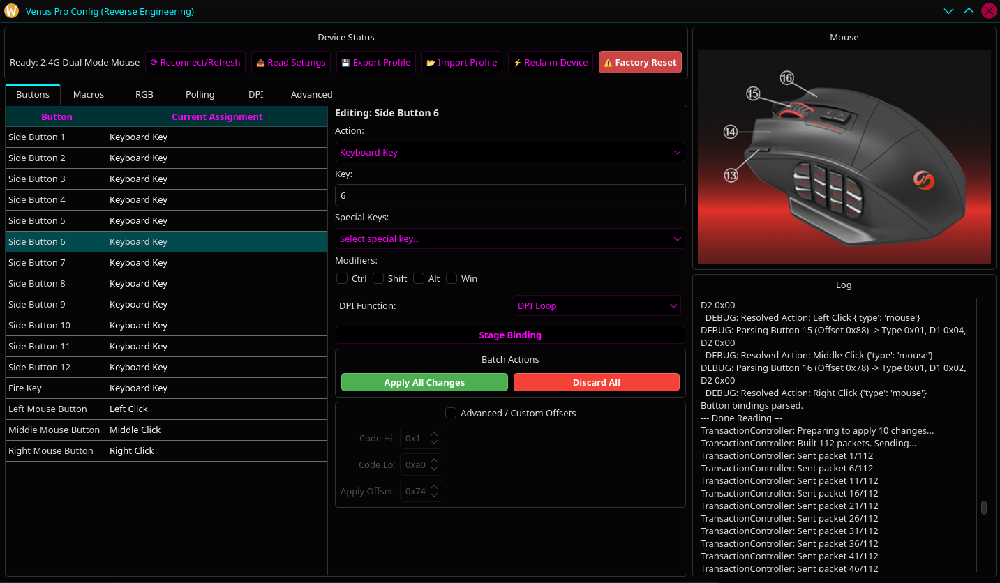
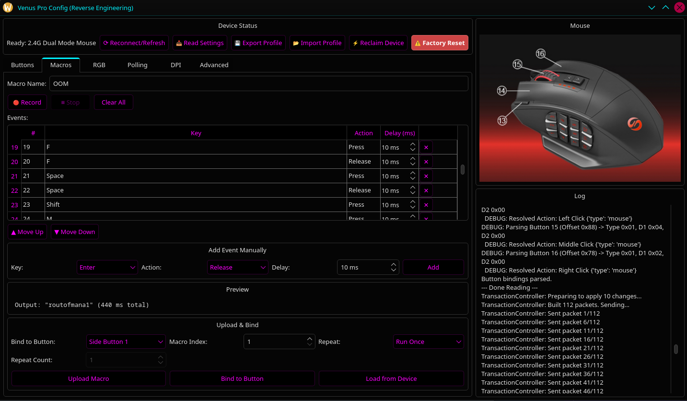

# Venus Pro Config (Linux)

A professional configuration utility for the UtechSmart Venus Pro MMO gaming mouse on Linux.

## Overview

The UtechSmart Venus Pro is a high-performance MMO gaming mouse featuring 16,000 DPI, 12 side buttons, and extensive macro capabilities. While it is an excellent tool for games like *World of Warcraft* and other MMOs, it lacks official configuration support on Linux. 

This project provides a reverse-engineered implementation of the mouse's HID protocol and a user-friendly GUI to manage bindings, macros, and lighting. It was created to fill the gap where no other viable Linux configuration methods existed.

## Features

- **Button Remapping:** Configure all 16 buttons, including the 12-button side panel.
- **Modifier Support:** Bind buttons to combinations (e.g., `Ctrl+Shift+1`, `Alt+F1`).
- **Macro Engine:** Visual macro editor to record and edit events with precise timing.
- **RGB Lighting:** WIP (read/write is not fully verified).
- **DPI & Polling Adjustments:** WIP (read/write is not fully verified).
- **Factory Reset:** One-click recovery to restore the device to its original factory state.

## Screenshots

Buttons tab:


Macros tab:


## Requirements

The utility is written in Python and uses PyQt6 for the interface.

- **Python 3.8+**
- **Cython** (for hidapi)
- **hidapi**
- **PyQt6**

## Installation

1. **Clone the repository:**
   ```bash
   git clone https://github.com/Es00bac/VenusProLinux.git
   cd VenusProLinux
   ```

2. **Install dependencies:**
   ```bash
   pip install cython hidapi PyQt6
   ```

3. **udev Rules (Recommended):**
   To access the mouse as a non-root user, create a udev rule:
   ```bash
   echo 'SUBSYSTEM=="usb", ATTRS{idVendor}=="25a7", ATTRS{idProduct}=="fa07", MODE="0666"' | sudo tee /etc/udev/rules.d/99-venus-pro.rules
   echo 'SUBSYSTEM=="usb", ATTRS{idVendor}=="25a7", ATTRS{idProduct}=="fa08", MODE="0666"' | sudo tee -a /etc/udev/rules.d/99-venus-pro.rules
   sudo udevadm control --reload-rules && sudo udevadm trigger
   ```

## Usage

Start the configuration utility:
```bash
python3 venus_gui.py
```

### How to use

1. Click **Read Settings** to load the current device state.
2. Use the **Buttons** tab to pick a button, set an action, then click **Apply Binding**.
3. Use the **Macros** tab to record or build a macro, then click **Upload Macro**.
4. Bind the macro to a button with **Bind to Button**.

### Tips
- **Wired Mode:** It is highly recommended to perform configuration while the mouse is in **wired mode** to ensure settings are correctly written to the flash memory.
- **Factory Reset:** If the mouse behaves oddly, the "Advanced" tab contains a Factory Reset button that restores all settings to default (Note: This wipes all custom macros!).
- **WIP Areas:** DPI, Polling Rate, and RGB controls are still under active reverse-engineering.

## Development

For those interested in the reverse-engineering process or contributing:
- `NEW_PROTOCOL.md`: Detailed documentation of the USB HID protocol.
- `win.md`: Notes on the Windows utility behavior.
- `venus_protocol.py`: Core protocol implementation.

## Acknowledgments
This utility was built through careful analysis of USB protocol captures to replicate the behavior of the official Windows driver.
